# DigitalSignature

Application for creating a digital signature

# Table of content

- [Project setup for developers](#set-up-for-developers)
- [Alternative setup for developers](#alternative-setup-for-developers)
- [Manual](#manual)
- [Application apperance](#application-apperance)

# Set up for developers

1. Clone git repository using following command: `git clone https://github.com/DigitalSignature-Project/DigitalSignature.git`

2. Download and install interpreter for `Python 3.12.0` from: `https://www.python.org/downloads/`.

3. Download and install Rust from: `https://rust-lang.org/tools/install/`.

4. Download Node.js from: `https://nodejs.org/en/download`.

5. Download CMake from: `https://cmake.org/download/`.

6. Download Visual Studio BuildTools with powershell command: `winget install Microsoft.VisualStudio.2022.BuildTools --silent --override "--wait --quiet --add Microsoft.VisualStudio.Workload.NativeDesktop --includeRecommended" `

7. Install all dependencies for application frontend. For more details check this manual: [Frontend manual](frontend/README.md)

8. Install all dependencies for application backend. For more details check this manual: [Backend manual](backend/README.md)

# Alternative setup for developers

### After completing the first 6 steps in the instructions above.

1. Install requests module for python: `pip install requests`

2. Use the `manage.py` script to install the remaining dependencies and run the project using the following commands:

- `python manage.py setup` - this command installs all necessary dependencies.
- `python manage.py build` - this command installs the developer version of the application.
- `python manage.py run` - this command launch application.
- `python manage.py prod` - this command builds utility applications

# Used technologies

1. Programing languages, server, database and main libraries:

- Backend:
  - Python 3.12 (FastApi)
  - C++ 20 (Cryptography)

- Frontend:
  - React.js (Axios)
  - TypeScript
  - Tailwind CSS

- Server:
  - Serverless Architecture

- Database:
  - Cloudflare D1 (SQLite)
  - Cloudflare Workers

# Manual

1. Install application using msi installer.
2. If you don't have account, create one by clicking on `Create account`.
3. Create a username and password for your account.
4. Create the key necessary to secure your private key generated automatically by the application
5. Log in to the user account you created earlier.
6. To create a digital signature for your file, go to the `Encrypt and Sign` tab.
7. Select the signature algorithm you are interested in from the list of available ones.
8. Sign the file by clicking the `Encrypt and Sign` button.
9. To verify the digital signature, go to the `Verify Signature` tab.
10. Select the file you want to verify and click the `Verify Signature` button.

# Application appearance

### 1. Application welcome window.

  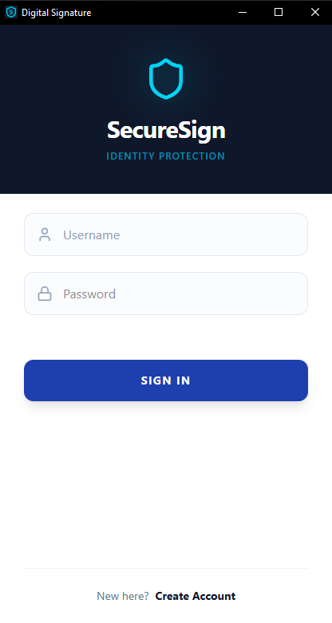

### 2. Window for creating a new user account.

  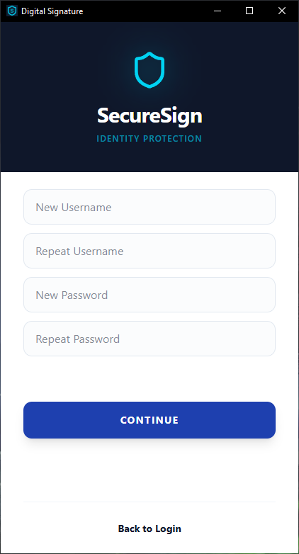

### 3. Window for creating a password for the private key used to create digital signatures

  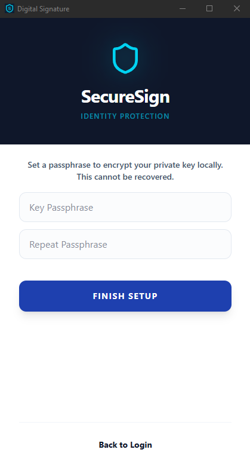

### 4. Password entry window for the private key

  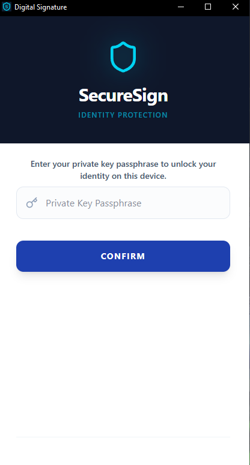

### 5. Application dashboard, the window that the user sees immediately after logging in.

  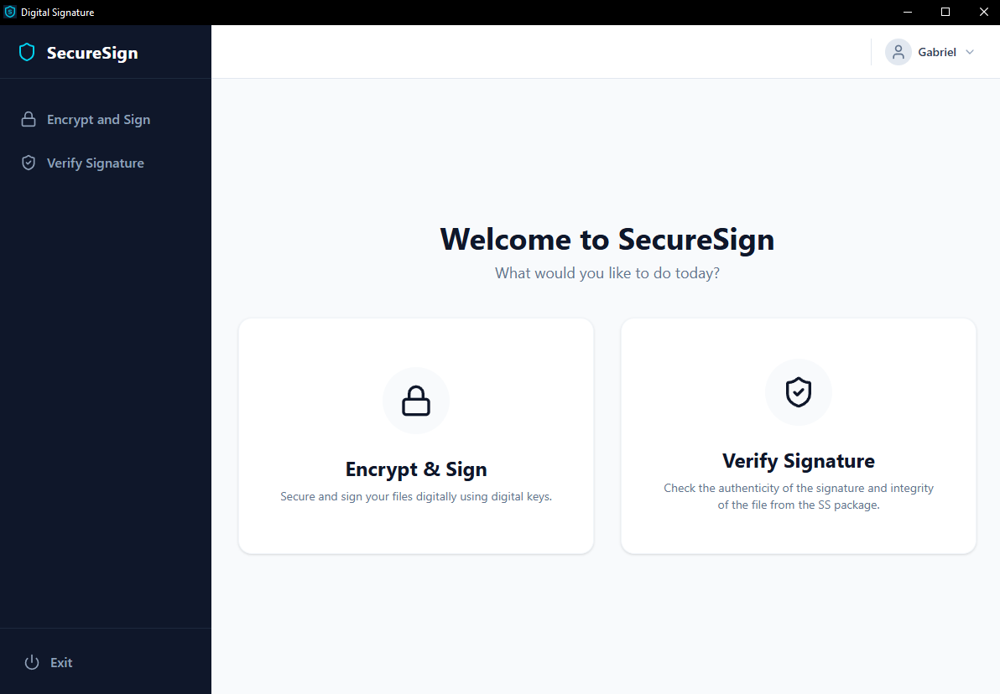

### 6. Window for creating a digital signature, RSA system.

  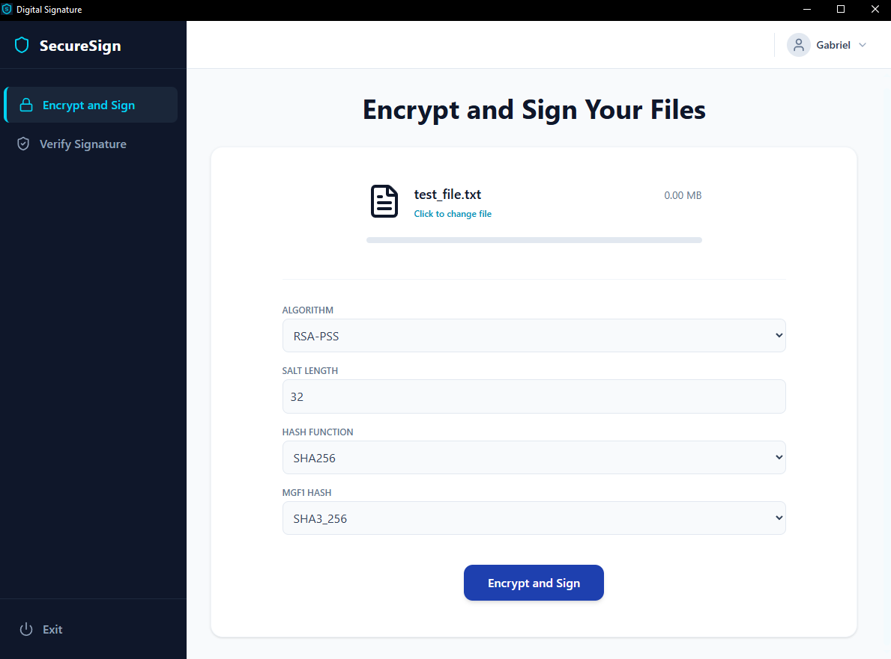

### 7. Window for creating a digital signature, ElGamal system.

  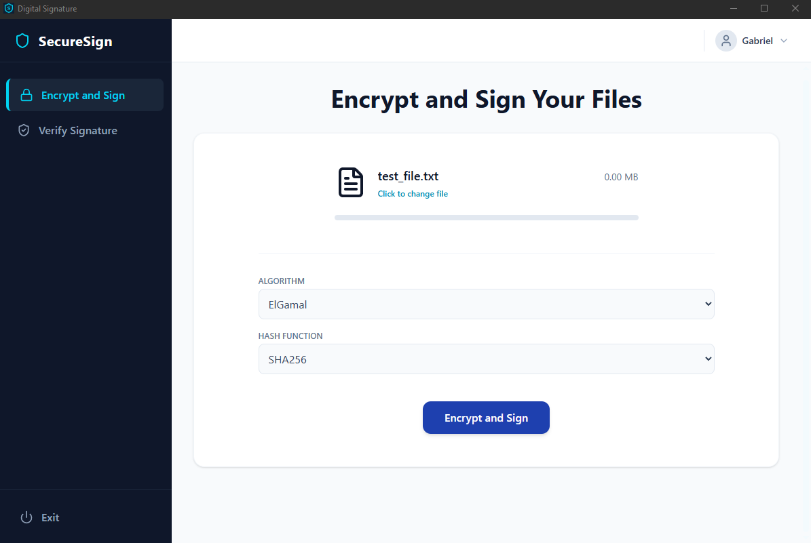

### 8. Window for creating a digital signature, ECDSA system.

  

### 9. Message window informing the user about a correctly created digital signature for the selected file.

  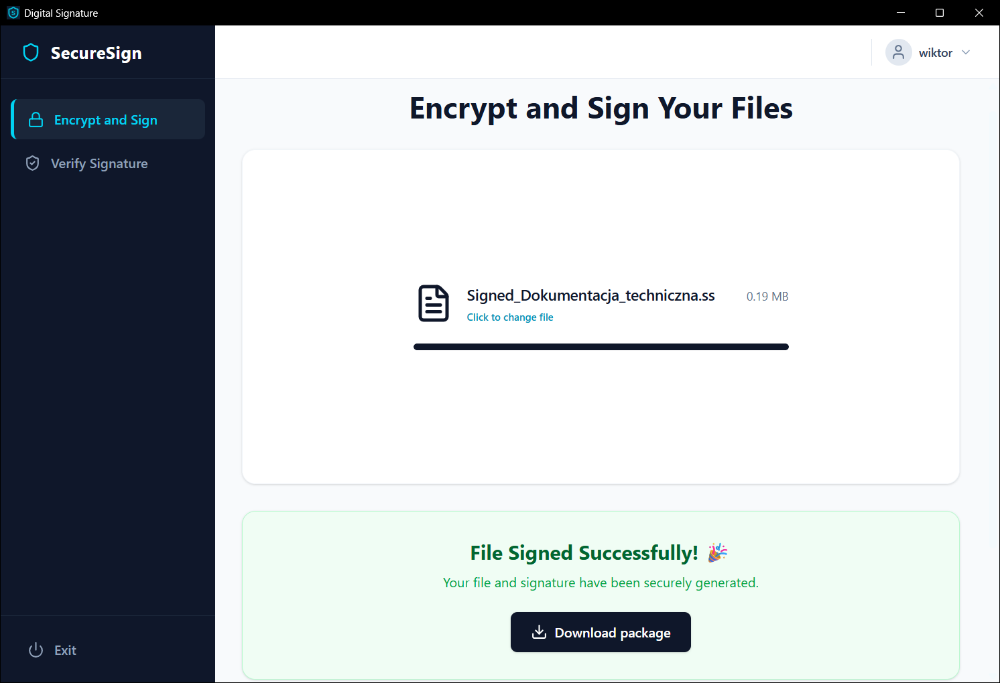

### 10. Window for verifying the digital signature (1).

  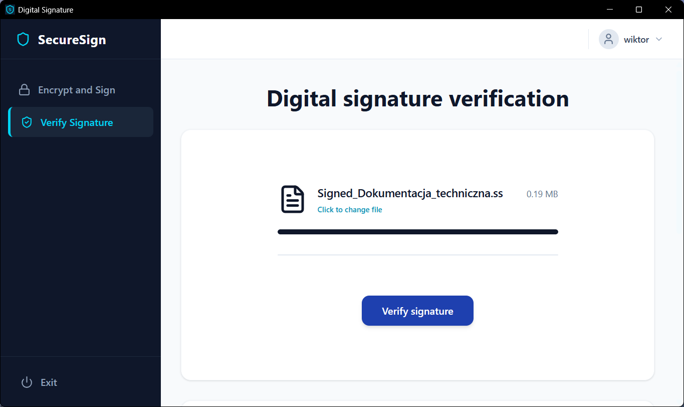

### 11. Window for verifying the digital signature (2).

  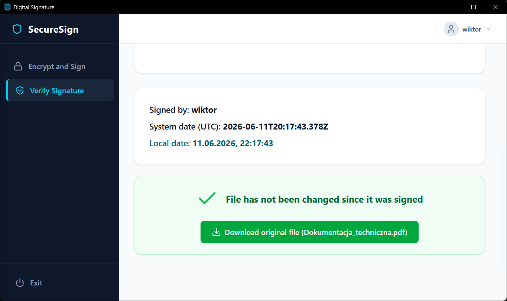

### 12. Own encryption file extension.

  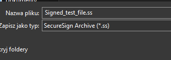

### 13. Location to log out of the currently logged in user's account.

  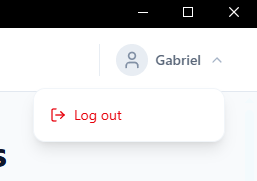

