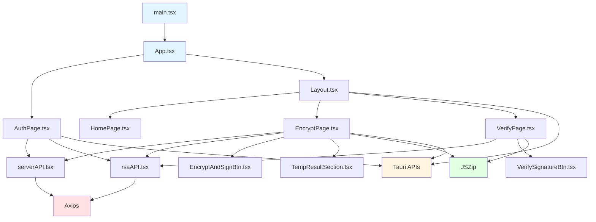

# Frontend Technical Documentation

## Overview

The frontend module is a React-based digital signature application built with TypeScript, designed to provide secure file encryption and digital signature verification capabilities. The application, named "SecureSign," serves as a desktop application using Tauri framework, enabling users to encrypt and sign files using various cryptographic algorithms (RSA, ElGamal, ECDSA) and verify digital signatures.

### Key Features
- User authentication with multi-factor security (password + key passphrase)
- File encryption and digital signing using multiple algorithms
- Signature verification for signed files
- Secure credential management using Tauri's secure storage
- Desktop application experience with window management
- Drag-and-drop file handling
- Archive generation for signed files

## Technology Stack

- **Framework**: React 19.2.4 with TypeScript
- **Desktop Framework**: Tauri 2.10.1
- **Routing**: React Router DOM 7.14.0
- **HTTP Client**: Axios 1.15.0
- **Styling**: Tailwind CSS 4.2.2 with DaisyUI 5.5.19
- **File Processing**: JSZip 3.10.1
- **Icons**: Lucide React 1.7.0
- **Build Tool**: Vite 8.0.1

## Directory Structure

```
frontend/
├── src/
│   ├── assets/              # Static assets (images, icons)
│   │   └── DigitalSignatureIcon.PNG
│   ├── components/         # Reusable UI components
│   │   ├── EncryptAndSignBtn.tsx
│   │   ├── TempResultSection.tsx
│   │   └── VerifySignatureBtn.tsx
│   ├── pages/             # Page-level components
│   │   ├── AuthPage.tsx
│   │   ├── EncryptPage.tsx
│   │   ├── HomePage.tsx
│   │   ├── Layout.tsx
│   │   └── VerifyPage.tsx
│   ├── services/          # API communication layer
│   │   ├── rsaAPI.tsx
│   │   └── serverAPI.tsx
│   ├── App.tsx            # Main application component with routing
│   ├── main.tsx           # Application entry point
│   └── index.css          # Global styles
├── src-tauri/             # Tauri backend configuration
├── public/                # Public assets
├── package.json           # Dependencies and scripts
├── tsconfig.json          # TypeScript configuration
├── vite.config.ts         # Vite build configuration
└── index.html             # HTML template
```

### Directory Descriptions

- **assets/**: Contains static assets used in the application, currently storing the application icon.
- **components/**: Reusable UI components that are shared across multiple pages. Includes button components and result display components.
- **pages/**: Main application pages representing different views in the application. Each page handles specific functionality.
- **services/**: API communication layer handling all HTTP requests to the backend server. Separates network logic from UI components.
- **src-tauri/**: Tauri backend configuration for desktop application functionality.

## Main React Components

### App.tsx
**Location**: `src/App.tsx`

The root component that sets up the application routing and authentication protection.

**Responsibilities**:
- Configures React Router with BrowserRouter
- Implements protected route logic for authentication
- Defines route structure for the application
- Handles authentication state checking using browser storage

**Key Features**:
- ProtectedRoute component that checks authentication status
- Routes for login (/login) and main application (/, /encrypt, /verify)
- Navigation to login page when authentication fails

### AuthPage.tsx
**Location**: `src/pages/AuthPage.tsx`

Authentication page handling user login, registration, and key passphrase verification.

**Responsibilities**:
- Multi-step authentication flow (LOGIN → LOGIN_PASSPHRASE)
- User registration with RSA key generation
- Key passphrase verification for two-factor authentication
- Window size management for desktop experience
- Form validation and error handling

**Key Features**:
- State management for different view modes (LOGIN, LOGIN_PASSPHRASE, REGISTER_1, REGISTER_2, FORGOT_PASSWORD)
- Integration with backend API for user authentication
- RSA key generation during registration
- Session management for secure credential storage
- Responsive window sizing based on authentication state

### Layout.tsx
**Location**: `src/pages/Layout.tsx`

Main layout component providing the application shell with navigation and user interface.

**Responsibilities**:
- Sidebar navigation with active state management
- User profile menu with logout functionality
- Window management for desktop application
- Header with user information display
- Application exit functionality

**Key Features**:
- Responsive sidebar navigation using React Router's NavLink
- Profile menu with dropdown functionality
- Window size management using Tauri API
- User authentication state display
- Clean, professional UI with consistent styling

### HomePage.tsx
**Location**: `src/pages/HomePage.tsx`

Landing page providing navigation to main application features.

**Responsibilities**:
- Display main application options
- Navigate to encryption/signing and verification pages
- Provide visual overview of application capabilities

**Key Features**:
- Card-based UI for feature selection
- Animated hover effects
- Clear visual hierarchy
- Responsive grid layout

### EncryptPage.tsx
**Location**: `src/pages/EncryptPage.tsx**

Main functionality page for file encryption and digital signing.

**Responsibilities**:
- File selection and upload handling
- Algorithm selection (RSA, ElGamal, ECDSA)
- Digital signature generation
- Configuration of cryptographic parameters
- Archive generation for signed files
- Progress tracking during signing process

**Key Features**:
- Drag-and-drop file upload
- Multiple cryptographic algorithm support
- Configurable hash functions (SHA256, etc.)
- Salt length configuration for RSA
- Real-time progress tracking
- ZIP archive generation with metadata
- Integration with Tauri file system APIs

### VerifyPage.tsx
**Location**: `src/pages/VerifyPage.tsx`

Signature verification page for validating digital signatures.

**Responsibilities**:
- Archive file upload and extraction
- Signature verification against original file
- Display verification results
- Support for multiple signature algorithms

**Key Features**:
- Archive extraction using JSZip
- Multi-algorithm signature verification (RSA, ElGamal, ECDSA)
- Visual feedback for verification results
- Error handling for invalid archives
- Progress tracking during verification

## Custom Hooks

**No custom hooks are currently implemented in the application.** The application uses standard React hooks (`useState`, `useEffect`, `useRef`, `useNavigate`) directly within components.

## Routing Configuration

The application uses React Router DOM for client-side routing with the following structure:

### Route Definitions

```typescript
<Route path="/login" element={<AuthPage />} />

<Route path="/" element={<ProtectedRoute><Layout /></ProtectedRoute>}>
  <Route index element={<HomePage />} />
  <Route path="encrypt" element={<EncryptPage />} />
  <Route path="verify" element={<VerifyPage />} />
</Route>
```

### Authentication Protection

The `ProtectedRoute` component implements authentication checking:

```typescript
const ProtectedRoute = ({ children }: { children: JSX.Element }) => {
  const isAuthenticated = 
    localStorage.getItem("isAuthenticated") === "true" || 
    sessionStorage.getItem("isAuthenticated") === "true";
  
  if (!isAuthenticated) {
    return <Navigate to="/login" replace />;
  }

  return children;
};
```

### Routing Features

- **Protected Routes**: Main application routes are protected by authentication check
- **Nested Routes**: Layout component wraps child routes using Outlet pattern
- **Authentication Persistence**: Uses both localStorage and sessionStorage for flexibility
- **Automatic Redirect**: Unauthenticated users are automatically redirected to login

## State Management

The application uses **React's built-in state management** with the following approach:

### Local Component State
- Components use `useState` hook for local state management
- No global state management library (Redux, Zustand, Context API) is implemented
- State is contained within individual components as needed

### Browser Storage Integration
- **localStorage**: Used for persistent user credentials
- **sessionStorage**: Used for temporary session data and authentication tokens
- **Tauri Storage**: Used for secure credential storage via `invoke("get_credentials")`

### Storage Keys Used

```typescript
// Authentication State
"isAuthenticated"      // Boolean authentication flag
"login"                // User login/username
"keyPassphrase"        // Encryption key passphrase

// Cryptographic Keys
"encryptedPrivateKey"  // User's encrypted private key
"keyModule"            // Key module for cryptographic operations
```

### State Management Patterns

**AuthPage.tsx**:
- Multi-step form state management
- View mode state for different authentication stages
- Error state for user feedback

**EncryptPage.tsx**:
- File selection state
- Algorithm configuration state
- Progress tracking state
- Signature result state

**VerifyPage.tsx**:
- File selection state
- Verification result state
- Progress tracking state

**Layout.tsx**:
- User profile menu state
- Window management state

## API Communication and Services

The application uses **Axios** for HTTP communication with a backend server running on `http://127.0.0.1:2138`. All API calls include a Bearer token authentication header.

### Service Layer Architecture

#### serverAPI.tsx
**Location**: `src/services/serverAPI.tsx`

Handles user authentication and registration operations.

**Endpoints**:
- `POST http://127.0.0.1:2138/server/verify_user_login` - User authentication
- `POST http://127.0.0.1:2138/server/register_new_user` - User registration
- `POST http://127.0.0.1:2138/server/check_user_key` - Key passphrase verification
- `POST http://127.0.0.1:2138/server/sign_file` - File signing (legacy)
- `POST http://127.0.0.1:2138/server/verify_file` - File verification (legacy)

**Authentication**: All requests use `Authorization: Bearer 2137` header.

#### rsaAPI.tsx
**Location**: `src/services/rsaAPI.tsx`

Handles cryptographic operations for multiple algorithms.

**Endpoints**:
- `POST http://127.0.0.1:2138/api/rsa_generate_keys` - RSA key generation
- `POST http://127.0.0.1:2138/api/rsa_generate_keys_parallel` - Parallel RSA key generation
- `POST http://127.0.0.1:2138/signature/generate_rsa_signature` - RSA signature generation
- `POST http://127.0.0.1:2138/signature/generate_elgamal_signature` - ElGamal signature generation
- `POST http://127.0.0.1:2138/signature/generate_ecdsa_signature` - ECDSA signature generation
- `POST http://127.0.0.1:2138/signature/verify_rsa_signature` - RSA signature verification
- `POST http://127.0.0.1:2138/signature/verify_elgamal_signature` - ElGamal signature verification
- `POST http://127.0.0.1:2138/signature/verify_ecdsa_signature` - ECDSA signature verification

### API Communication Patterns

**Request Structure**:
```typescript
// Standard POST request pattern
const { data } = await axios.post<ResponseType>(
  "http://127.0.0.1:2138/endpoint",
  requestData,
  {
    headers: {
      Authorization: "Bearer 2137",
    },
  }
);
```

**Error Handling**: Limited error handling implemented, mostly relying on try-catch blocks in components.

**Response Types**: TypeScript interfaces defined for each API response type.

### Cryptographic Operations

**Supported Algorithms**:
- **RSA**: Full signature generation and verification with configurable salt length and dual hash functions
- **ElGamal**: Signature generation and verification with single hash function
- **ECDSA**: Signature generation and verification with single hash function

**File Processing**:
- Files converted to hexadecimal string representation
- Signatures generated using user's encrypted private key
- Verification uses public keys stored on server

## Dependency Diagram



## Component Responsibility Table

| Component | Location | Primary Responsibility | Key Dependencies |
|-----------|-----------|----------------------|------------------|
| App.tsx | src/App.tsx | Routing configuration, authentication protection | React Router, Pages |
| AuthPage.tsx | src/pages/AuthPage.tsx | User authentication, registration, key management | serverAPI, rsaAPI, Tauri |
| Layout.tsx | src/pages/Layout.tsx | Application shell, navigation, user management | React Router, Tauri, Pages |
| HomePage.tsx | src/pages/HomePage.tsx | Landing page, feature navigation | React Router |
| EncryptPage.tsx | src/pages/EncryptPage.tsx | File encryption and signing | rsaAPI, Components, JSZip, Tauri |
| VerifyPage.tsx | src/pages/VerifyPage.tsx | Signature verification | rsaAPI, Components, JSZip |
| EncryptAndSignBtn.tsx | src/components/EncryptAndSignBtn.tsx | Reusable sign button | None |
| VerifySignatureBtn.tsx | src/components/VerifySignatureBtn.tsx | Reusable verify button | None |
| TempResultSection.tsx | src/components/TempResultSection.tsx | Result display component | None |
| serverAPI.tsx | src/services/serverAPI.tsx | User authentication API communication | Axios |
| rsaAPI.tsx | src/services/rsaAPI.tsx | Cryptographic operations API | Axios |

## Developer Notes

### Areas Requiring Refactoring or Special Attention

#### 1. **Error Handling**
**Issue**: Limited error handling across the application, especially in API calls.
**Recommendation**: Implement centralized error handling with proper user feedback and logging mechanisms.
**Priority**: High

#### 2. **State Management**
**Issue**: No global state management solution, leading to prop drilling and scattered state.
**Recommendation**: Consider implementing Context API or a state management library for user authentication and cryptographic keys.
**Priority**: Medium

#### 3. **Security Concerns**
**Issue**: Hardcoded Bearer token ("Bearer 2137") in API calls.
**Recommendation**: Implement proper token management and secure token storage.
**Priority**: Critical

#### 4. **Type Safety**
**Issue**: Some components use `any` types (e.g., signatureData in EncryptPage.tsx).
**Recommendation**: Define proper TypeScript interfaces for all data structures.
**Priority**: Medium

#### 5. **Code Duplication**
**Issue**: Similar file handling logic in EncryptPage and VerifyPage.
**Recommendation**: Extract common file handling logic into custom hooks or utility functions.
**Priority**: Low

#### 6. **API Configuration**
**Issue**: Hardcoded API base URL (http://127.0.0.1:2138) throughout the codebase.
**Recommendation**: Centralize API configuration in environment variables or config files.
**Priority**: High

#### 7. **Authentication Flow**
**Issue**: Multi-step authentication in AuthPage.tsx is complex and could benefit from simplification.
**Recommendation**: Consider breaking down into smaller components or using a form library.
**Priority**: Medium

#### 8. **Window Management**
**Issue**: Window size logic is tightly coupled with authentication state.
**Recommendation**: Extract window management into separate Tauri service.
**Priority**: Low

#### 9. **Testing**
**Issue**: No visible testing infrastructure in the project.
**Recommendation**: Add unit tests for components and integration tests for API services.
**Priority**: Medium

#### 10. **Progress Tracking**
**Issue**: Progress tracking uses artificial progress increments rather than actual progress.
**Recommendation**: Implement real progress tracking based on API progress events if available.
**Priority**: Low

#### 11. **Internationalization**
**Issue**: Mixed language in UI (Polish and English text).
**Recommendation**: Implement proper internationalization (i18n) solution.
**Priority**: Low

#### 12. **Component Organization**
**Issue**: Some components are large and handle multiple responsibilities (e.g., AuthPage.tsx).
**Recommendation**: Break down large components into smaller, focused sub-components.
**Priority**: Medium

### Performance Considerations

1. **Large File Handling**: Current implementation converts entire files to hex strings, which may cause memory issues with large files.
2. **Progress Simulation**: Progress bars are simulated rather than reflecting actual operation progress.
3. **Bundle Size**: Consider code splitting for better initial load performance.

### Security Recommendations

1. **Credential Storage**: Ensure Tauri credential storage is properly configured for secure persistence.
2. **Input Validation**: Add comprehensive input validation for all user inputs, especially cryptographic parameters.
3. **HTTPS**: Implement HTTPS for API communication in production environments.
4. **Token Security**: Implement proper token refresh and revocation mechanisms.

### Deployment Considerations

1. **Environment Configuration**: Set up proper environment configuration for different deployment stages.
2. **API Endpoint Configuration**: Make API endpoints configurable for different environments.
3. **Desktop Distribution**: Configure Tauri build settings for target platforms.
4. **Auto-update**: Consider implementing auto-update functionality for the desktop application.

---

**Documentation Generated**: 2026-06-11  
**Frontend Version**: Based on package.json analysis  
**Framework**: React 19.2.4 with Tauri 2.10.1